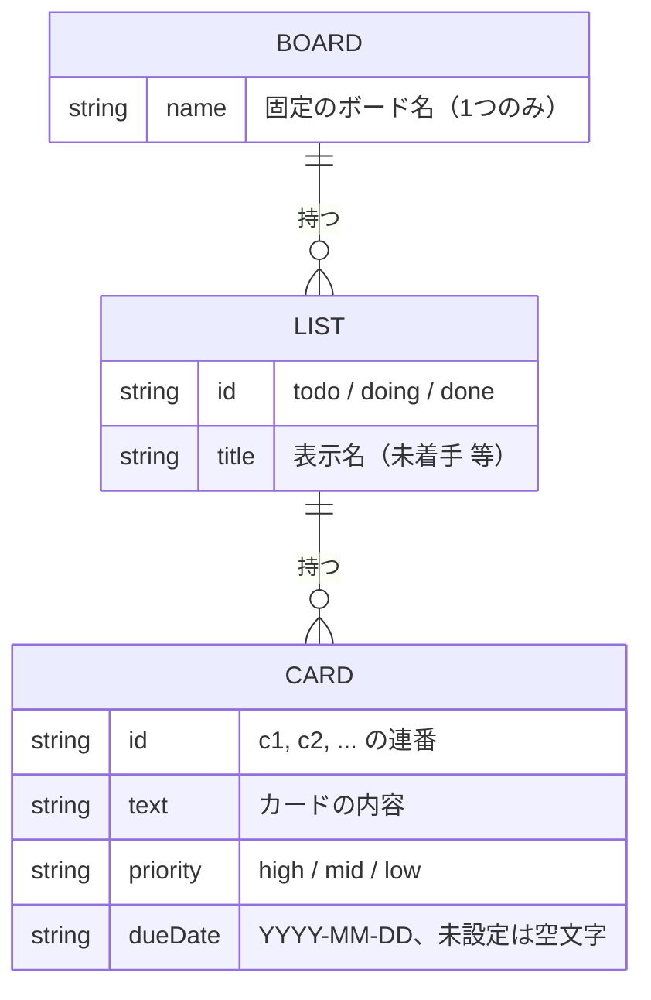

# データベース設計（データ構造・ER図）

[要件定義書](../要件定義書.md) の詳細資料です。

## 1. データ構造

アプリ内部では、ボードの状態を以下のようなJavaScriptの配列・オブジェクトで管理する。

```js
board = [
  {
    id: "todo",       // リストの識別子
    title: "未着手",   // 画面に表示するリスト名
    cards: [
      { id: "c1", text: "牛乳を買う", priority: "mid", dueDate: "" },
      { id: "c2", text: "宿題をやる", priority: "high", dueDate: "2026-03-05" }
    ]
  },
  {
    id: "doing",
    title: "作業中",
    cards: [ { id: "c3", text: "課題アプリを作る", priority: "high", dueDate: "" } ]
  },
  {
    id: "done",
    title: "完了",
    cards: []
  }
]
```

- `priority`は`"high"`（高）/ `"mid"`（中）/ `"low"`（低）の3段階
- `dueDate`は`"YYYY-MM-DD"`形式の文字列、または未設定を表す空文字列`""`
- `localStorage`には、上記`board`を`JSON.stringify`で文字列化した状態で、キー`"trello-board"`として保存する
- 優先度・期限を追加する前の古い保存データを読み込んだ場合は、`priority: "mid"` / `dueDate: ""`を自動的に補う

## 2. データの関連図

本アプリはリレーショナルデータベースを使用せず、`localStorage`に単純な入れ子構造のJSONを1つ保存するだけの構成のため、テーブル間の外部キー関連を表す正式なER図は作成しない。代わりに、データの親子関係（1対多の関連）を簡易的な構造図として示す。



- 1つのボードは複数のリスト（未着手／作業中／完了）を持つ
- 1つのリストは複数のカードを持つ
- リスト・カードともに、親（ボード／リスト）と切り離されて単独では存在しない

## 3. 今後の拡張予定（バックエンド化）

学習の発展として、Node.js + Express + SQLiteによるバックエンド実装を予定している。その際は`board`/`list`/`card`をSQLiteの実テーブルとして再設計し、本ドキュメントを更新する（マルチユーザー対応は対象外）。
