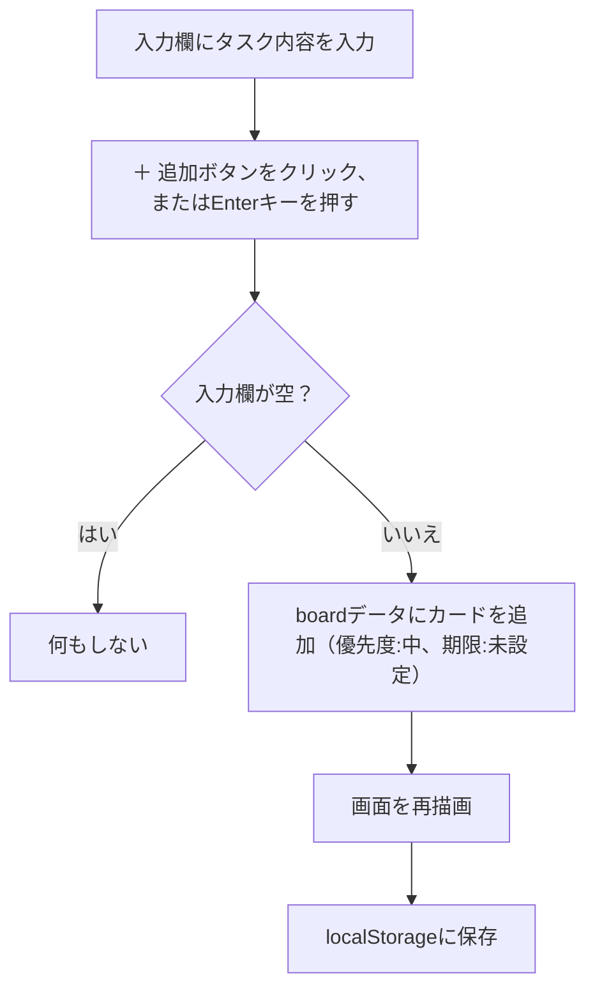
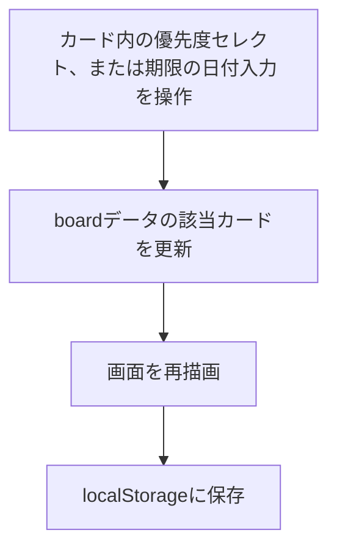
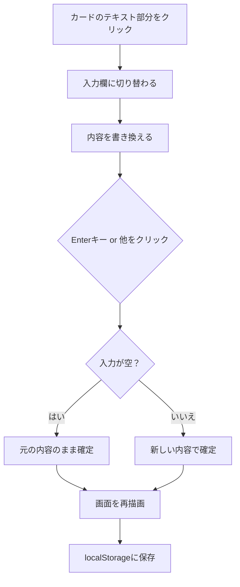
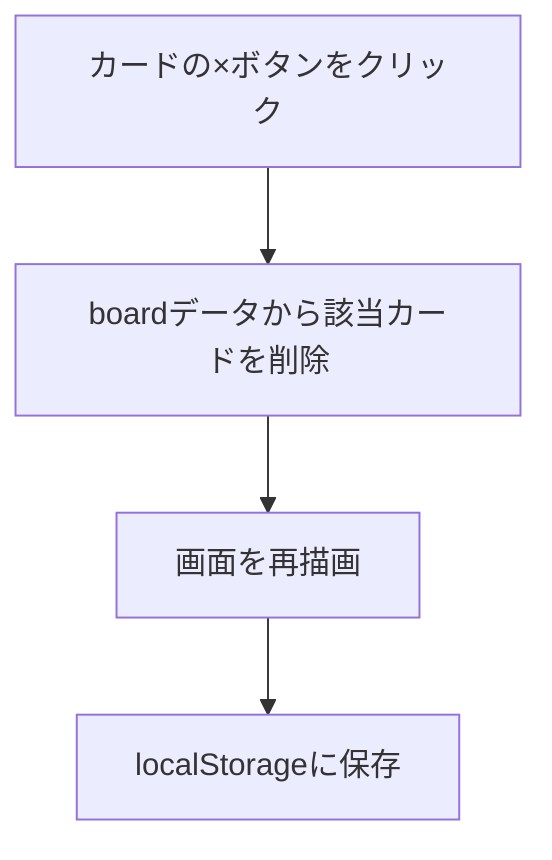
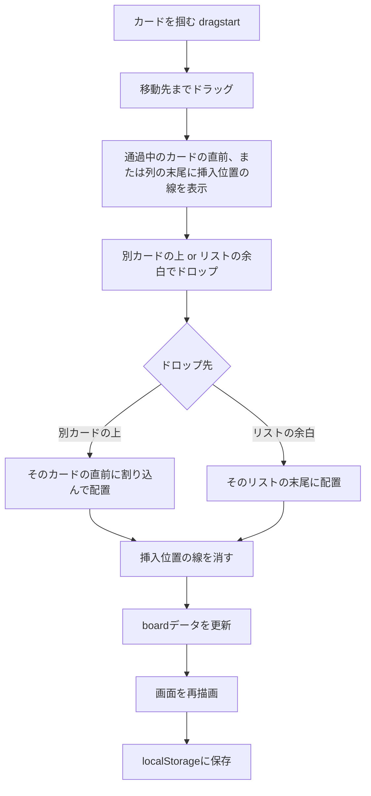

# 画面設計・操作フロー

[要件定義書](../要件定義書.md) の詳細資料です。

## 1. 画面一覧

本アプリの画面は以下の1画面のみで構成される（画面遷移は発生しない、シングルページ構成）。

| 画面名 | 説明 |
|---|---|
| ボード画面 | タスクの一覧・作成・編集・削除・移動をすべて行うメイン画面 |

## 2. 画面構成（ワイヤーフレーム）

```
+--------------------------------------------------------------+
|  タスク管理ボード                                              |
+--------------------------------------------------------------+
|  [ 未着手      ]      [ 作業中      ]      [ 完了        ]    |
|  [優先度順▲][期限順▲] [優先度順▲][期限順▲] [優先度順▲][期限順▲]|
|  +-------------+      +-------------+      +-------------+    |
|  | カード1   × |      | カード3   × |      |             |    |
|  | [優先度][期限]|     | [優先度][期限]|     |             |    |
|  +-------------+      +-------------+      +-------------+    |
|  | カード2   × |      |             |      |             |    |
|  | [優先度][期限]|     |             |      |             |    |
|  +-------------+      +-------------+      +-------------+    |
|  [入力欄][+追加]      [入力欄][+追加]      [入力欄][+追加]    |
+--------------------------------------------------------------+
```

| 画面要素 | 説明 |
|---|---|
| ページタイトル | 「タスク管理ボード」の見出しを画面上部に表示 |
| ボード | 3つのリストを横並びに表示するエリア |
| リスト | リスト名（見出し）、ソートボタン、カード一覧、カード追加フォームで構成 |
| ソートボタン | 「優先度順」「期限順」の2つ。クリックするたびに昇順（▲）・降順（▼）が切り替わる |
| カード | タスク内容のテキスト、削除ボタン（×）、優先度の選択欄、期限の日付入力欄で構成。テキストはクリックで編集可能、カード全体をドラッグで移動可能 |

## 3. 操作フロー

### カードを追加する



### 優先度・期限を変更する



### カードを並び替える（ソート）

```mermaid
flowchart TD
    A["優先度順"または"期限順"ボタンをクリック] --> B{今の並び順は？}
    B -- 昇順中 or 未ソート --> C[降順に切り替えて並び替え]
    B -- 降順中 --> D[昇順に切り替えて並び替え]
    C --> E[ボタンの矢印表示を更新]
    D --> E
    E --> F[画面を再描画]
    F --> G[localStorageに保存]
```

### カードを編集する



### カードを削除する



### カードをドラッグ&ドロップで移動する


