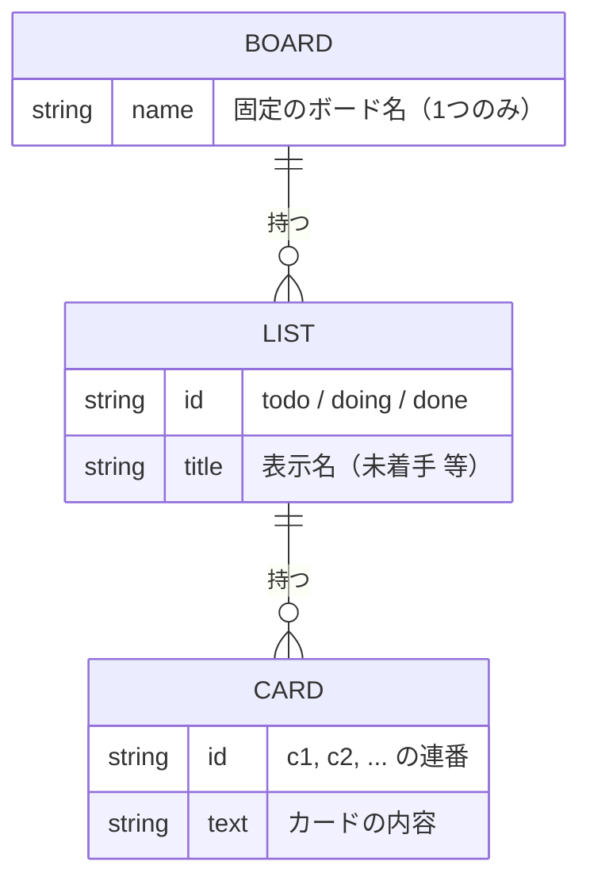
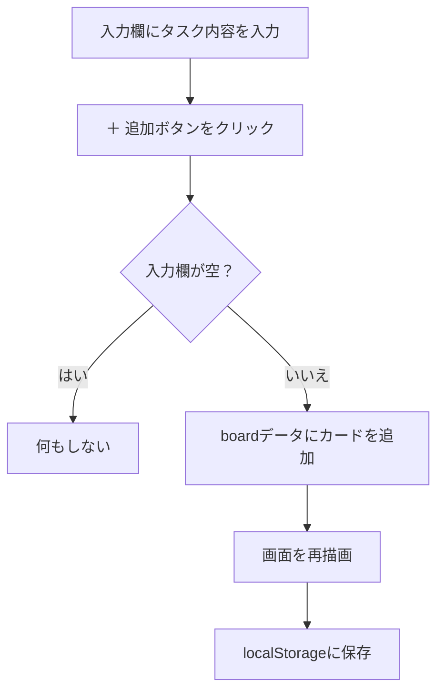
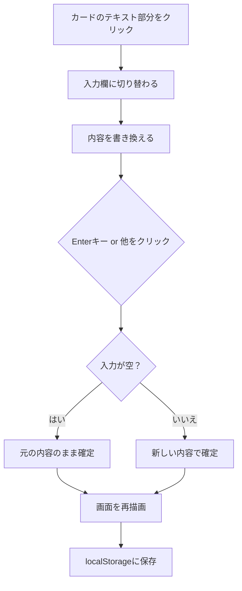
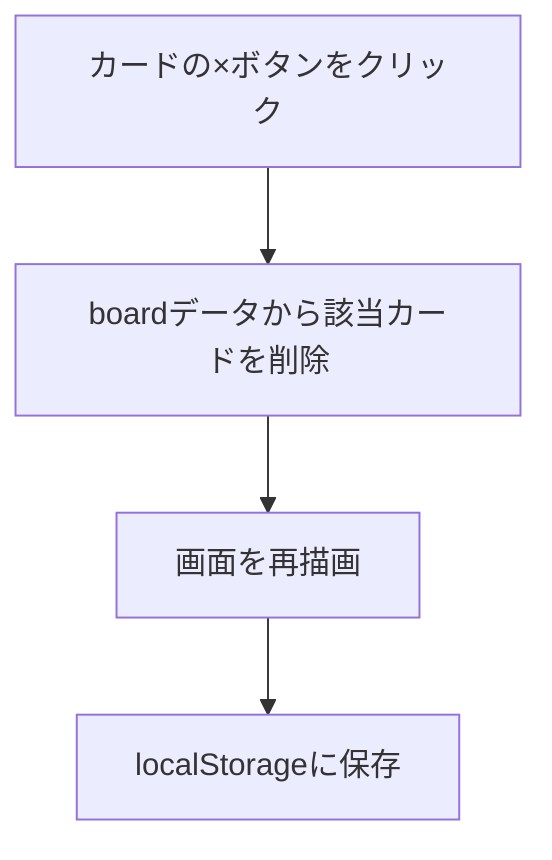
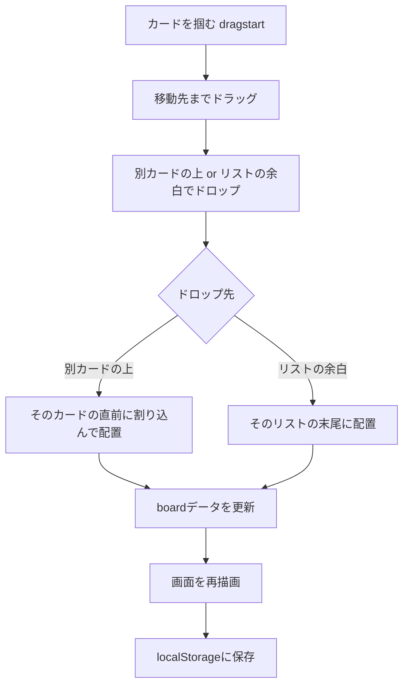

# タスク管理アプリ 要件定義書

## 1. 概要

### 1.1 プロジェクト名
Trello風タスク管理アプリ

### 1.2 位置づけ
本プロジェクトは、プログラミングスクールの課題として作成する学習用アプリケーションである。特定の顧客・依頼者は存在せず、実際の業務利用や納品を目的としたものではない。

### 1.3 目的
Trelloのようなカンバン方式（列にタスクカードを並べて管理する方式）のタスク管理アプリを、HTML・CSS・JavaScriptの基礎（変数・関数・配列・DOM操作・イベント処理・データ永続化など）を習得することを目的として開発する。ユーザーが直感的にタスクを作成・整理・進捗管理できるシンプルなWebアプリケーションを、学習の成果物として完成させる。

### 1.4 対象ユーザー
個人でタスクを整理したい人（学習用課題としての想定利用者は開発者自身）。

## 2. 前提・制約

| 項目 | 内容 |
|---|---|
| 動作環境 | Webブラウザ（Google Chrome / Microsoft Edge等の最新版） |
| サーバー | 不要（ローカルの`index.html`をブラウザで開くだけで動作） |
| データベース | 使用しない |
| フレームワーク | 使用しない（素のHTML / CSS / JavaScriptのみ） |
| データ保存先 | ブラウザの`localStorage`（サーバーやアカウントをまたいだ共有は不可） |
| 対応デバイス | PCブラウザを想定（スマートフォン等のレスポンシブ対応は本バージョンでは対象外） |

## 3. 機能要件

### 3.1 ボード・リスト表示
- アプリ起動時、以下3つの固定リストを表示する
  - 未着手（todo）
  - 作業中（doing）
  - 完了（done）
- リストは画面上に横並びで表示する
- 各リストの中に、そのリストに属するカードを縦に並べて表示する

### 3.2 カードの作成
- 各リストの下部に、テキスト入力欄と「＋ 追加」ボタンを設置する
- ユーザーがテキストを入力し「＋ 追加」ボタンを押すと、そのリストの末尾に新しいカードが追加される
- 入力欄が空の状態でボタンを押した場合、カードは追加されない
- カード追加後、入力欄は空の状態にリセットされる

### 3.3 カードの編集
- カードのテキスト部分をクリックすると、テキスト入力欄に切り替わり編集可能になる
- 編集内容は、Enterキーの押下、または入力欄からフォーカスが外れた（他の場所をクリックした）タイミングで確定・保存される
- 編集後の内容が空文字だった場合は、編集前の内容を保持する（空のカードにはしない）

### 3.4 カードの削除
- 各カードに削除ボタン（×）を表示する
- 削除ボタンをクリックすると、そのカードを即座にリストから削除する
- 削除確認のダイアログは表示しない

### 3.5 カードの移動（ドラッグ&ドロップ）
- カードはマウスでドラッグして移動できる
- 同一リスト内でドラッグした場合、カードの並び順を変更できる
- 別のリストにドラッグした場合、カードをそのリストへ移動できる
- ドラッグ中は、対象のカードの見た目を半透明にして操作中であることが分かるようにする
- 他のカードの上にドロップした場合は、そのカードの直前に割り込む形で配置する
- カードが存在しない余白部分にドロップした場合は、そのリストの末尾に配置する

### 3.6 データの永続化
- カードの作成・編集・削除・移動を行うたびに、現在のボードの状態をブラウザの`localStorage`に自動保存する
- ページを再読み込み（リロード）した際は、`localStorage`に保存された状態を復元して表示する
- `localStorage`にデータが存在しない場合（初回起動時等）は、あらかじめ用意されたサンプルデータを表示する

## 4. 非機能要件

### 4.1 動作環境・互換性
- 主要ブラウザの最新版（Google Chrome、Microsoft Edge、Mozilla Firefox、Safari）で正しく動作すること
- 上記以外の古いブラウザ・非対応ブラウザでの動作は保証しない
- スマートフォン等の小さい画面幅への最適化（レスポンシブ対応）は対象外とする

### 4.2 性能・データ量
- 想定データ量は、個人利用規模として最大でも数十枚程度のカード（例：各リスト20枚、合計60枚程度）とする
- データ更新のたびに画面全体を再描画する簡易な設計とするが、上記の想定データ量の範囲では操作にストレスのない応答速度で動作すること
- 保存先である`localStorage`は、ブラウザ・環境によって容量上限（一般的に1オリジンあたり5〜10MB程度）があり、この上限を超えるデータ量は本アプリの保証範囲外とする

### 4.3 可用性・障害時の挙動
- ブラウザの設定で`localStorage`が無効化されている環境（プライベートブラウジング等の制限含む）では、データの保存・復元ができない場合がある。その場合でも、アプリ自体はエラーで停止せず、保存されない状態のまま単発利用（リロードで初期データに戻る）はできるものとする
- `localStorage`内のデータが何らかの理由で壊れ、正しく読み込めなかった場合は、エラーで停止せず、あらかじめ用意されたサンプルデータ（初期状態）にフォールバックして表示する
- 本アプリはブラウザの標準機能のみで完結するため、サーバーダウンによる障害は想定しない（サーバーを使用しないため）

### 4.4 操作性
- クリック・ドラッグといった直感的な操作のみでタスク管理が完結すること
- 特別な操作説明を読まなくても、Trello等のカンバン型ツールに触れたことがあれば直感的に使える見た目・挙動とする

### 4.5 保守性
- 機能ごとに関数を分割し、コード中にコメントで処理内容を明記する
- HTML・CSS・JavaScriptの3ファイルに役割を分離し、修正箇所を特定しやすくする

### 4.6 セキュリティ
- ログイン機能や外部サーバーとの通信を持たないため、認証・通信の盗聴・改ざんに関するセキュリティ要件は対象外とする
- 保存されるデータは利用者のブラウザ内（`localStorage`）に閉じ、外部に送信されることはない
- 氏名・パスワード等の個人情報の入力・保存は想定しない

## 5. データ構造

アプリ内部では、ボードの状態を以下のようなJavaScriptの配列・オブジェクトで管理する。

```js
board = [
  {
    id: "todo",       // リストの識別子
    title: "未着手",   // 画面に表示するリスト名
    cards: [
      { id: "c1", text: "牛乳を買う" },
      { id: "c2", text: "宿題をやる" }
    ]
  },
  {
    id: "doing",
    title: "作業中",
    cards: [ { id: "c3", text: "課題アプリを作る" } ]
  },
  {
    id: "done",
    title: "完了",
    cards: []
  }
]
```

- `localStorage`には、上記`board`を`JSON.stringify`で文字列化した状態で、キー`"trello-board"`として保存する

### 5.1 データの関連図

本アプリはリレーショナルデータベースを使用せず、`localStorage`に単純な入れ子構造のJSONを1つ保存するだけの構成のため、テーブル間の外部キー関連を表す正式なER図は作成しない。代わりに、データの親子関係（1対多の関連）を簡易的な構造図として示す。



- 1つのボードは複数のリスト（未着手／作業中／完了）を持つ
- 1つのリストは複数のカードを持つ
- リスト・カードともに、親（ボード／リスト）と切り離されて単独では存在しない

## 6. 画面仕様・操作フロー

### 6.1 画面一覧
本アプリの画面は以下の1画面のみで構成される（画面遷移は発生しない、シングルページ構成）。

| 画面名 | 説明 |
|---|---|
| ボード画面 | タスクの一覧・作成・編集・削除・移動をすべて行うメイン画面 |

### 6.2 画面構成（ワイヤーフレーム）

```
+--------------------------------------------------------------+
|  タスク管理ボード                                              |
+--------------------------------------------------------------+
|  [ 未着手      ]   [ 作業中      ]   [ 完了        ]          |
|  +-----------+     +-----------+     +-----------+            |
|  | カード1 × |     | カード3 × |     |           |            |
|  +-----------+     +-----------+     +-----------+            |
|  | カード2 × |     |           |     |           |            |
|  +-----------+     +-----------+     +-----------+            |
|  [入力欄][+追加]   [入力欄][+追加]   [入力欄][+追加]           |
+--------------------------------------------------------------+
```

| 画面要素 | 説明 |
|---|---|
| ページタイトル | 「タスク管理ボード」の見出しを画面上部に表示 |
| ボード | 3つのリストを横並びに表示するエリア |
| リスト | リスト名（見出し）、カード一覧、カード追加フォームで構成 |
| カード | タスク内容のテキストと削除ボタン（×）で構成。クリックで編集可能、ドラッグで移動可能 |

### 6.3 操作フロー

#### カードを追加する



#### カードを編集する



#### カードを削除する



#### カードをドラッグ&ドロップで移動する



## 7. 技術選定

### 7.1 使用技術

| 分類 | 技術 |
|---|---|
| マークアップ | HTML5 |
| スタイル | CSS3（Flexboxによるレイアウト） |
| ロジック | JavaScript（ES6以降、DOM操作、HTML5 Drag and Drop API） |
| データ保存 | Web Storage API（localStorage） |
| ビルドツール | なし（ブラウザで`index.html`を直接開いて動作） |

### 7.2 選定理由

| 技術 | 選定理由 | 検討した代替案・不採用の理由 |
|---|---|---|
| フレームワーク不使用（素のJavaScript） | 学習目的であり、DOM操作・イベント処理・配列操作といったJavaScriptの基礎を体で覚えることを優先したため | React等のフレームワークも検討したが、内部の仕組み（仮想DOM等）を理解する前に導入すると、基礎の習得が疎かになると判断し不採用とした |
| ビルドツール不使用 | `index.html`をブラウザで開くだけで動作させ、環境構築の手間を無くすため | Viteなどのビルドツールも検討したが、学習の初期段階ではNode.js・npm等の周辺知識が必要になり、目的（HTML/CSS/JSの基礎習得）から外れるため不採用とした |
| `localStorage`（Web Storage API） | サーバーやデータベースを用意せずに、ブラウザだけでデータを永続化できるため | サーバー＋データベース構成（Node.js＋SQLite等）も検討したが、API設計やサーバー運用など学習範囲が大きく広がるため、今回のスコープでは不採用とした |
| HTML5 Drag and Drop API | ブラウザ標準機能のみでドラッグ&ドロップを実現でき、追加ライブラリが不要なため | `@dnd-kit`等のD&D専用ライブラリも検討したが、ライブラリの使い方を覚えることが目的化してしまうため、標準APIで仕組みそのものを理解する方針とした |
| CSS3（Flexbox、素のCSS） | 追加のCSSライブラリなしで、列を横並びにするレイアウトを実現できるため | Bootstrap等のCSSフレームワークも検討したが、独自クラス体系の習得よりCSSそのものの理解を優先し不採用とした |

## 8. 対象外の機能（本バージョンでは実装しない）

- ユーザー登録・ログイン機能
- 複数ボードの作成・切り替え
- リストの追加・削除・名称変更
- カードの詳細情報（期限、担当者、ラベル、コメント等）
- 複数人でのリアルタイム共有
- スマートフォン向けのレスポンシブ対応・タッチ操作対応
